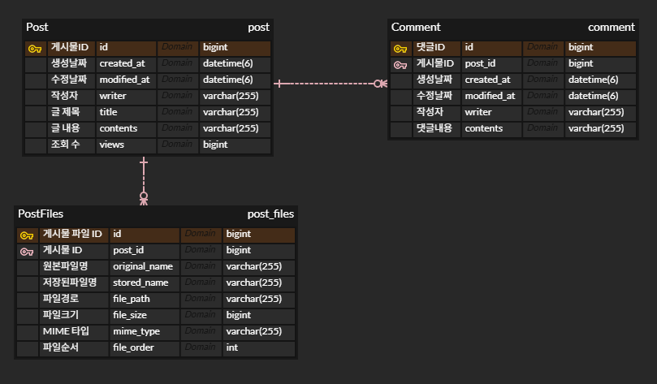

<h1>버전 1.0.0</h1>
<h2>기능</h2>

게시글 등록, 조회, 수정, 삭제(성공 응답만 표시)
 

API 문서화 툴 Swagger 적용

<h2>기능 명세</h2>

  <b>게시글 등록</b> : 작성자, 글 제목, 글 내용을 등록합니다. 생성날짜와 조회 수(기본 0)는 자동으로 생성됩니다.

  <b>게시글 조회</b> : 단건 조회와 목록 조회가 있습니다. 단건 조회 시, 조회 수가 1 증가 합니다.
   목록 조회 시 리스트로 조회됩니다.

  <b>게시글 수정</b> : 게시글을 단건 수정합니다. 글 제목과 글 내용을 수정할 수 있습니다. 
   권한 기능이 없으므로, 누구나 게시글 수정이 가능합니다.

  <b>게시글 삭제</b> : 게시글을 삭제합니다. 권한 기능이 없으므로, 누구나 게시글 삭제가 가능합니다.

<h1>게시판 프로젝트 ERD</h1>

